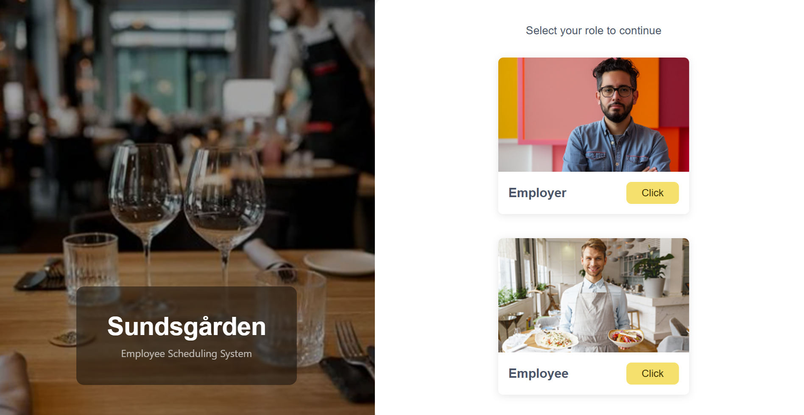

# Sundsgården — Employee Scheduling System


*A full-stack web application for managing employee schedules, availability, and shift assignments in a restaurant environment.*

---



---

## Table of Contents

- [Features](#features)
  - [Employer](#employer)
  - [Employee](#employee)
- [Technologies & Tools](#technologies--tools)
  - [Frontend](#frontend)
  - [Backend](#backend)
  - [Database](#database)
  - [Infrastructure](#infrastructure)
- [Project Structure](#project-structure)
- [Running the Project](#running-the-project)
  - [Docker (recommended)](#docker-recommended)
  - [Local Development](#local-development)
- [Environment Variables](#environment-variables)
- [Security](#security)
- [Authors](#authors)

---

## Features

### Employer

- **Employee Management** — View, add, and manage all registered employees.
- **Shift Scheduling** — Assign employees to morning, afternoon, and night shifts for each day of the week.
- **Work Schedule View** — Visual overview of the full weekly schedule by shift and day.
- **Job Schedule** — Manage shift definitions (name, start time, end time).

### Employee

- **Personal Schedule** — View assigned shifts for the current week.
- **Availability** — Submit and update availability preferences for each day and shift.
- **Profile View** — See personal information and role details.

---

## Technologies & Tools

### Frontend

| Technology | Purpose |
|---|---|
| [React 19](https://react.dev/) | UI component library |
| [Vite 8](https://vitejs.dev/) | Build tool and dev server |
| [ESLint](https://eslint.org/) | Code linting |
| [Vitest](https://vitest.dev/) | Unit and component testing |
| [Testing Library](https://testing-library.com/) | React component testing utilities |

### Backend

| Technology | Purpose |
|---|---|
| [Node.js](https://nodejs.org/) | Runtime environment |
| [Express 5](https://expressjs.com/) | HTTP server and routing |
| [express-openid-connect](https://github.com/auth0/express-openid-connect) | Auth0 OIDC authentication middleware |
| [bcrypt](https://github.com/kelektiv/node.bcrypt.js) | Password hashing |
| [Zod](https://zod.dev/) | Schema validation |
| [Winston](https://github.com/winstonjs/winston) | Structured server-side logging |
| [dotenv](https://github.com/motdotla/dotenv) | Environment variable management |
| [Vitest](https://vitest.dev/) | Unit and integration testing |

### Database

| Technology | Purpose |
|---|---|
| [PostgreSQL](https://www.postgresql.org/) | Relational database |
| [Prisma 6](https://www.prisma.io/) | ORM and schema migrations |

### Infrastructure

| Technology | Purpose |
|---|---|
| [Docker](https://www.docker.com/) | Containerisation |
| [Docker Compose](https://docs.docker.com/compose/) | Multi-service orchestration |
| [Nginx](https://nginx.org/) | Serves the built frontend in production |

---

## Project Structure

```
Employee_Scheduling/
├── docker-compose.yml        # Orchestrates postgres, backend, and frontend
├── client/                   # React + Vite frontend
│   ├── src/
│   │   ├── components/       # UI components (EmployerView, EmployeeView, LoginScreen…)
│   │   ├── styles/           # Component-scoped CSS
│   │   ├── utils/            # Helpers (authStorage)
│   │   └── assets/           # Images and static files
│   ├── .dockerignore         # Excludes node_modules and .env from the image
│   └── Dockerfile            # Nginx-based production image
└── server/                   # Node.js + Express backend
    ├── index.js              # Entry point
    ├── app.js                # Express app factory (injectable deps for testing)
    ├── logger.js             # Winston logger setup
    ├── Auth/
    │   └── auth.js           # Auth0 OIDC configuration
    ├── routes/               # auth, employees, availability, schedule
    ├── prisma/
    │   ├── schema.prisma     # Database schema
    │   └── seed.ts           # Database seeding script
    └── docker/
        ├── backend.Dockerfile
        └── frontend.Dockerfile
```

---

## Running the Project

### Docker (recommended)

| Step | Action | Command |
|---|---|---|
| 1 | Copy `.env.example` to `server/.env` and fill in your Auth0 credentials (see [Environment Variables](#environment-variables)) | — |
| 2 | Start all services from the project root.<br>**Frontend:** http://localhost:5173<br>**Backend API:** http://localhost:4000<br>**PostgreSQL:** localhost:5433 | `docker compose up --build` |
| 3 | Stop and remove volumes | `docker compose down -v` |

### Local Development

Requires Node.js and a running PostgreSQL instance.

| Service | Directory | Commands |
|---|---|---|
| Backend | `server/` | `npm install`<br>`npx prisma db push`<br>`npm run dev` — nodemon on port 4000 |
| Frontend | `client/` | `npm install`<br>`npm run dev` — Vite dev server on port 5173 |

---


## Security

- `.env` files are excluded from Git via `.gitignore` and from Docker images via `.dockerignore`
- Docker images never contain host `node_modules` — each image installs its own dependencies
- Secrets are injected into containers at runtime via `docker-compose.yml` environment variables, never baked into images
- Passwords are hashed with bcrypt before storage
- All inputs are validated with Zod before reaching the database

---

## Reflections

---

## Authors

- **Backend Course Student** — Full-stack development
    - Deborah Boateng
    - Gláucia Silva Bierwagen
    - Jane Lehtola
