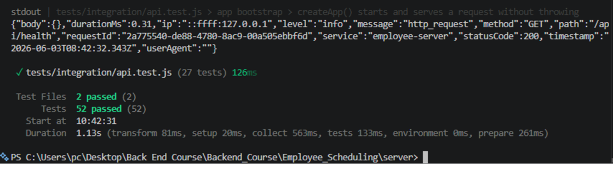
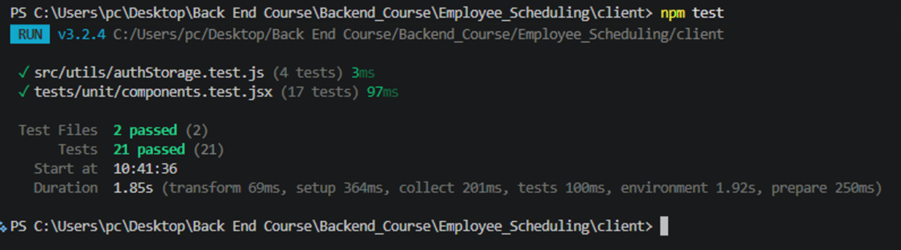
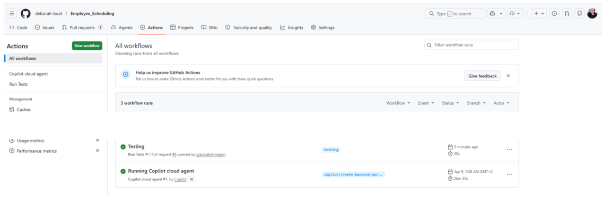

# Sundsgården — Employee Scheduling System


*A full-stack web application for managing employee schedules, availability, and shift assignments in a restaurant environment.*

---


[Figma Prototype](https://www.figma.com/proto/5pFg4O1uXgn8UQ3TH8wLV8/Restarurant-Project_Design?node-id=33-10595&t=QxcmE2yvdcgN6Kno-1&scaling=min-zoom&content-scaling=fixed&page-id=0%3A1&starting-point-node-id=20%3A2516&show-proto-sidebar=1)

---

## Table of Contents

- [Features](#features)
  - [Employer](#employer)
  - [Employee](#employee)
- [Technologies & Tools](#technologies--tools)
- [Project Structure](#project-structure)
- [Running the Project](#running-the-project)
  - [Docker (recommended)](#docker-recommended)
  - [Local Development](#local-development)
- [Environment Variables](#environment-variables)
- [Testing](#testing)
- [Authentication and Security](#security)
- [Authors](#authors)

---

## Features

### Employer

- **Employee Management** — View, add, and manage all registered employees.
- **Shift Scheduling** — Assign employees to morning, afternoon, and night shifts for each day of the week.
- **Work Schedule View** — Visual overview of the full weekly schedule by shift and day.
- **Job Schedule** — Manage shift definitions (name, start time, end time).

### Employee

- **Personal Schedule** — View assigned shifts for the current week.
- **Availability** — Submit and update availability preferences for each day and shift.
- **Profile View** — See personal information and role details.

---

## Technologies & Tools

| Category | Technology | Purpose |
|---|---|---|
| Frontend | [React 19](https://react.dev/) | UI component library |
| Frontend | [Vite 8](https://vitejs.dev/) | Build tool and dev server |
| Frontend | [ESLint](https://eslint.org/) | Code linting |
| Frontend | [Vitest](https://vitest.dev/) | Unit and component testing |
| Frontend | [Testing Library](https://testing-library.com/) | React component testing utilities |
| Backend | [Node.js](https://nodejs.org/) | Runtime environment |
| Backend | [Express 5](https://expressjs.com/) | HTTP server and routing |
| Backend | [express-openid-connect](https://github.com/auth0/express-openid-connect) | Auth0 OIDC authentication middleware |
| Backend | [bcrypt](https://github.com/kelektiv/node.bcrypt.js) | Password hashing |
| Backend | [Zod](https://zod.dev/) | Schema validation |
| Backend | [Winston](https://github.com/winstonjs/winston) | Structured server-side logging |
| Backend | [dotenv](https://github.com/motdotla/dotenv) | Environment variable management |
| Backend | [Vitest](https://vitest.dev/) | Unit and integration testing |
| Database | [PostgreSQL](https://www.postgresql.org/) | Relational database |
| Database | [Prisma 6](https://www.prisma.io/) | ORM and schema migrations |
| Infrastructure | [Docker](https://www.docker.com/) | Containerisation |
| Infrastructure | [Docker Compose](https://docs.docker.com/compose/) | Multi-service orchestration |
| Infrastructure | [Nginx](https://nginx.org/) | Serves the built frontend in production |

---

## Project Structure

```
Employee_Scheduling/
├── docker-compose.yml        # Orchestrates postgres, backend, and frontend
├── client/                   # React + Vite frontend
│   ├── src/
│   │   ├── components/       # UI components (EmployerView, EmployeeView, LoginScreen…)
│   │   ├── styles/           # Component-scoped CSS
│   │   ├── utils/            # Helpers (authStorage)
│   │   └── assets/           # Images and static files
│   ├── .dockerignore         # Excludes node_modules and .env from the image
│   └── Dockerfile            # Nginx-based production image
└── server/                   # Node.js + Express backend
    ├── index.js              # Entry point
    ├── app.js                # Express app factory (injectable deps for testing)
    ├── logger.js             # Winston logger setup
    ├── Auth/
    │   └── auth.js           # Auth0 OIDC configuration
    ├── routes/               # auth, employees, availability, schedule
    ├── prisma/
    │   ├── schema.prisma     # Database schema
    │   └── seed.ts           # Database seeding script
    └── docker/
        ├── backend.Dockerfile
        └── frontend.Dockerfile
```

---

## Running the Project

### Docker (recommended)

| Step | Action | Command |
|---|---|---|
| 1 | Copy `.env.example` to `server/.env` and fill in your Auth0 credentials (see [Environment Variables](#environment-variables)) | — |
| 2 | Start all services from the project root.<br>**Frontend:** http://localhost:5173<br>**Backend API:** http://localhost:4000<br>**PostgreSQL:** localhost:5433 | `docker compose up --build` |
| 3 | Stop and remove volumes | `docker compose down -v` |

### Local Development

Requires Node.js and a running PostgreSQL instance.

| Service | Directory | Commands |
|---|---|---|
| Backend | `server/` | `npm install`<br>`npx prisma db push`<br>`npm run dev` — nodemon on port 4000 |
| Frontend | `client/` | `npm install`<br>`npm run dev` — Vite dev server on port 5173 |

---

## Testing

Both the backend and frontend use [Vitest](https://vitest.dev/) as the test runner.

### How to Run the Tests

| Part | Test types | Command |
|------|------------|---------|
| **Backend** | Unit + Integration | `cd server` then `npm test` |
| **Frontend** | Unit | `cd client` then `npm test` |

The backend uses a fake Prisma client and mock bcrypt — no real database or Auth0 credentials are needed to run the tests.

<details>
<summary><strong>Backend — Unit Tests</strong> &nbsp;·&nbsp; <code>server/tests/unit/employees.test.js</code> &nbsp;·&nbsp; 25 tests</summary>

<br>

Pure helper functions tested in isolation — no database, no network, no Express.

| Function | What it checks |
|----------|----------------|
| `normalizeEmail` | Lowercases an email that has uppercase letters |
| `normalizeEmail` | Strips leading and trailing whitespace |
| `isValidRole` | Accepts `"employee"` |
| `isValidRole` | Accepts `"employer"` |
| `isValidRole` | Accepts mixed case (normalizes before checking) |
| `isValidRole` | Rejects an arbitrary string |
| `isValidRole` | Rejects an empty string |
| `parseId` | Parses a valid numeric string to an integer |
| `parseId` | Returns `NaN` for a non-numeric string |
| `parseId` | Returns `NaN` for an empty string |
| `filterEmployeesByName` | Returns all employees when no name filter is provided |
| `filterEmployeesByName` | Finds an employee by partial name (case-insensitive) |
| `filterEmployeesByName` | Returns multiple employees when the search term matches several |
| `filterEmployeesByName` | Returns an empty array when no employee matches |
| `validateEmployeeInput` | Returns `ok:true` for valid name and email |
| `validateEmployeeInput` | Returns `ok:false` when name is empty |
| `validateEmployeeInput` | Returns `ok:false` when name is whitespace only |
| `validateEmployeeInput` | Returns `ok:false` when email has no `@` symbol |
| `validateEmployeeInput` | Returns `ok:false` when email is missing |
| `validateAvailabilityInput` | Returns `ok:true` for a valid availability record |
| `validateAvailabilityInput` | Accepts `shift_id` as a numeric string (coerces it) |
| `validateAvailabilityInput` | Returns `ok:false` when date is missing |
| `validateAvailabilityInput` | Returns `ok:false` when `shift_id` is zero |
| `validateAvailabilityInput` | Returns `ok:false` when `shift_id` is not a number |
| `validateAvailabilityInput` | Returns `ok:false` when status is empty |



</details>

<details>
<summary><strong>Backend — Integration Tests</strong> &nbsp;·&nbsp; <code>server/tests/integration/api.test.js</code> &nbsp;·&nbsp; 27 tests</summary>

<br>

Real HTTP requests sent to the Express app via [supertest](https://github.com/ladjs/supertest).

| Endpoint | Scenario | Expected result |
|----------|----------|-----------------|
| `GET /api/health` | Server is running | `200` + `{ status: "ok" }` |
| `POST /api/login` | Missing required fields | `400` Bad Request |
| `POST /api/login` | Role is not `"employee"` or `"employer"` | `400` Bad Request |
| `POST /api/login` | User does not exist in the database | `401` Unauthorized |
| `POST /api/login` | Password is wrong | `401` Unauthorized |
| `POST /api/login` | Valid credentials | `200` + user info |
| `GET /employees` | No auth required | `200` + array of employees |
| `POST /employees` | `x-role` header is not `"employer"` | `403` Forbidden |
| `POST /employees` | Body fails validation (missing email) | `400` Bad Request |
| `POST /employees` | Valid input with employer role | `201` Created |
| `DELETE /employees/:id` | `x-role` is not `"employer"` | `403` Forbidden |
| `DELETE /employees/:id` | ID is not a valid number | `400` Bad Request |
| `DELETE /employees/:id` | Valid employer + valid ID | `204` No Content |
| `GET /availability/:id` | ID is not a valid number | `400` Bad Request |
| `GET /availability/:id` | Valid employee ID | `200` + availability array |
| `PUT /availability/:id` | ID is not a valid number | `400` Bad Request |
| `PUT /availability/:id` | Body fails Zod validation (missing `shift_id`) | `400` Bad Request |
| `PUT /availability/:id` | No existing record — creates new | `200` + created record |
| `GET /schedule` | No auth required | `200` + array |
| `PUT /schedule` | `x-role` is not `"employer"` | `403` Forbidden |
| `PUT /schedule` | Body fails Zod validation (missing `shift_id`) | `400` Bad Request |
| `PUT /schedule` | Valid shift assignment | `200` + assignment |
| `DELETE /schedule` | `x-role` is not `"employer"` | `403` Forbidden |
| `DELETE /schedule` | Shift instance does not exist | `204` No Content |
| `DELETE /schedule` | Shift instance exists | `204` No Content |
| CORS preflight | `OPTIONS` request from frontend origin | `Access-Control-Allow-Origin` matches |
| App bootstrap | `createApp()` starts without throwing | `200` on health check |



</details>

<details>
<summary><strong>Frontend — Unit Tests</strong> &nbsp;·&nbsp; <code>client/tests/unit/components.test.jsx</code> &nbsp;·&nbsp; 17 tests</summary>

<br>

Fake component wrappers tested in isolation using [Testing Library](https://testing-library.com/) with `jsdom`.

| Component | What it checks |
|-----------|----------------|
| `LoginScreen` | Shows the employer subtitle when role is `"employer"` |
| `LoginScreen` | Shows the employee subtitle when role is `"employee"` |
| `LoginScreen` | Shows a validation error when submitted with empty fields |
| `EmployeeList` | Shows "No employees found." when the list is empty |
| `EmployeeList` | Renders each employee name and position |
| `EmployeeList` | Shows the placeholder emoji when an employee has no profile picture |
| `EmployeeList` | Shows the profile image when an employee has a picture |
| `EmployerView` | Shows the Employees tab content by default |
| `EmployerView` | Renders all four navigation tabs |
| `EmployerView` | Switches to the Register employee tab when clicked |
| `RegisterEmployeeForm` | Renders first name, last name, and email fields |
| `RegisterEmployeeForm` | Does not submit when required name fields are empty |
| `RegisterEmployeeForm` | Calls `onSubmit` and shows confirmation when fields are filled |
| `App` (auth guard) | Shows the role-selection screen when no role is set |
| `App` (auth guard) | Shows the employer dashboard when role is `"employer"` |
| `App` (auth guard) | Shows the employee dashboard when role is `"employee"` |
| `App` (auth guard) | Hides the employer dashboard when no role is set |

</details>

details>
<summary><strong>Gitub actions</strong> &nbsp;·&nbsp; <code>client/tests/unit/components.test.jsx</code> &nbsp;·&nbsp; 17 tests</summary>

<br>



</details>


---


## Authentication and Security

### Authentication

Authentication is implemented using **Auth0** via the [`express-openid-connect`](https://github.com/auth0/express-openid-connect) library, which implements the **OAuth 2.0 Authorization Code Flow with OIDC**.

When a user clicks **"Continue with Auth0"** on the login screen, the frontend calls `POST /api/auth/login`, which invokes `res.oidc.login()`. This redirects the user to the Auth0 hosted login page where they authenticate with their credentials. After a successful login, Auth0 redirects back to the `/callback` endpoint on the backend. The `express-openid-connect` middleware handles the token exchange automatically and establishes an **encrypted session cookie** on the browser.

From that point on, every request from the frontend carries the session cookie automatically. Protected backend routes are guarded with the `requiresAuth()` middleware, also from `express-openid-connect`. This middleware checks `req.oidc.isAuthenticated()` — if the session is missing or expired, the request is rejected with `401 Unauthorized` before reaching the route handler. If the session is valid, the decoded user profile (`sub`, `email`, `name`) is available on `req.oidc.user`, allowing the route to serve the protected resource.

The `/api/auth/session` endpoint reads `req.oidc.user` and returns the user's id, email, display name, and role to the frontend so the UI can render the correct view (employer or employee dashboard).

### Security Decisions

- **No secret API keys are committed to the repository.** All credentials (Auth0 client ID, client secret, session secret, database URL) are stored in a `.env` file, which is listed in `.gitignore` and `.dockerignore`. Exposing these keys would allow unauthorized access to the Auth0 tenant and the database.
- **Protected routes return `401 Unauthorized` for unauthenticated requests** because the session cookie is either absent or invalid. This prevents unauthenticated users from reading or modifying protected data.
- **Role-based access returns `403 Forbidden` for insufficient permissions.** Employer-only routes (registering employees, editing the schedule) check the `x-role` request header and reject requests from employees or unauthenticated callers before any database operation is attempted.
- **CORS is configured to only allow requests from the frontend origin** (`CLIENT_ORIGIN` environment variable). This prevents unauthorized domains from making cross-origin requests to the API.
- **Auth session state is stored in an encrypted server-side session cookie, not in `localStorage`.** Values in `localStorage` are accessible to any JavaScript running on the page and can be stolen in XSS attacks. Session cookies with `HttpOnly` and `Secure` flags are not accessible to client-side scripts.
- **The session cookie uses `sameSite: 'None'` + `secure: true` in production (HTTPS)** and `sameSite: 'Lax'` in local development (HTTP). The `sameSite` attribute reduces the risk of CSRF attacks by controlling when the browser sends the cookie on cross-site requests.
- **`credentials: true` is set in the CORS configuration** so that the browser includes the session cookie on authenticated cross-origin requests between the frontend and the backend.
- **Passwords are hashed with `bcrypt`** before being stored in the database. Plain-text passwords are never persisted, so a database leak does not expose user credentials directly.
- **All incoming request bodies are validated with Zod schemas** before any database operation. Invalid or malformed input is rejected with a `400 Bad Request` response, preventing unexpected data from reaching the database layer.
- **Secrets are injected into containers at runtime** via `docker-compose.yml` environment variables and are never baked into Docker images, so published images do not contain credentials.

---

## Reflections

---

## Authors

- **Backend Course Student** — Full-stack development
    - Deborah Boateng
    - Gláucia Silva Bierwagen
    - Jane Lehtola
